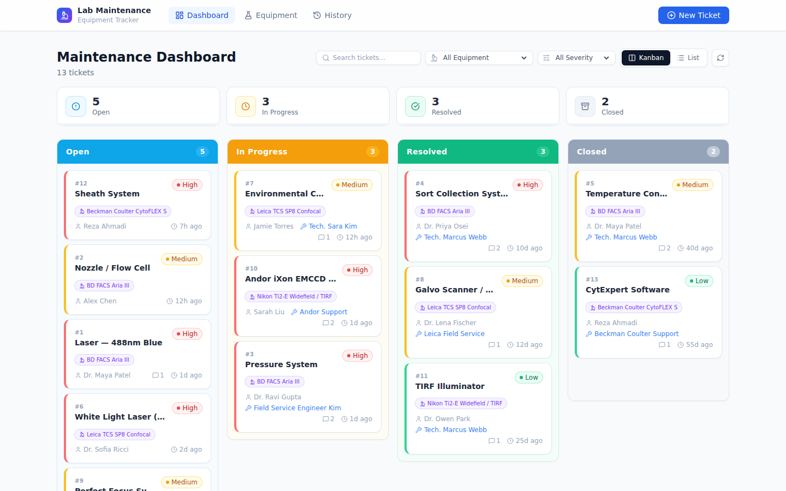
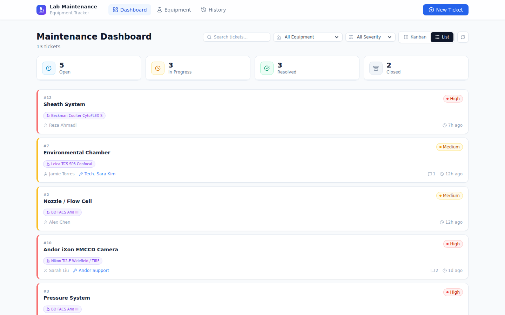
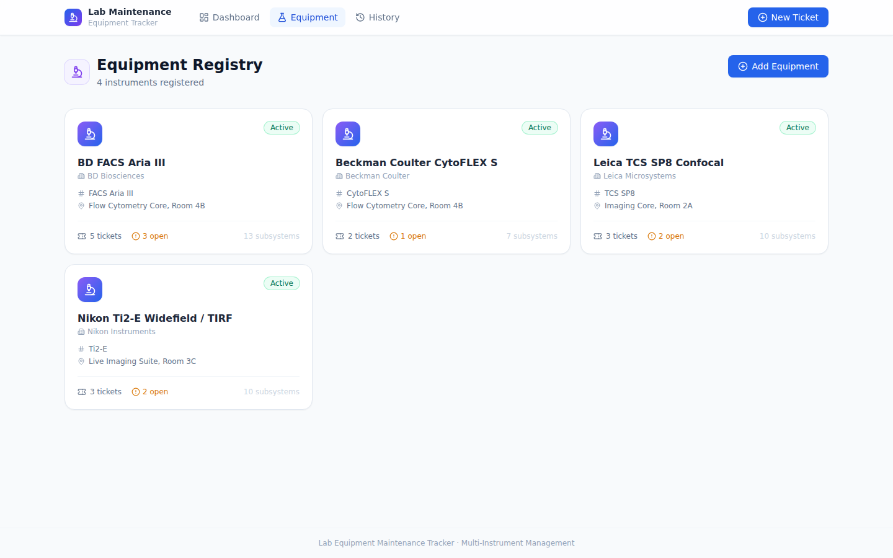
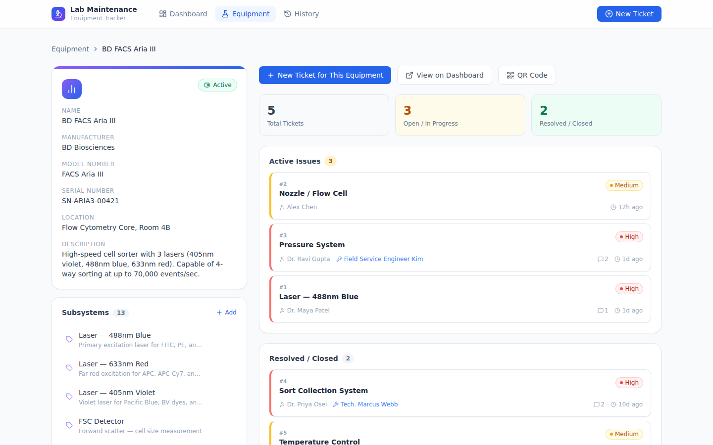
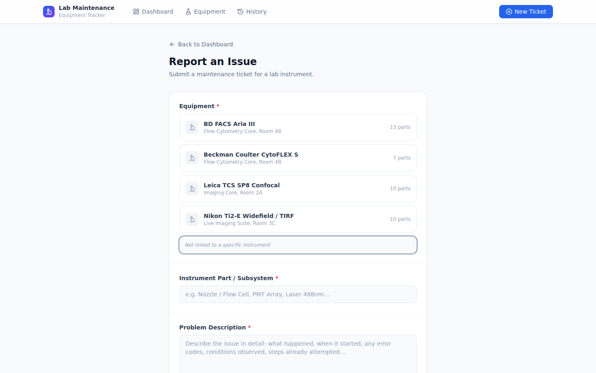
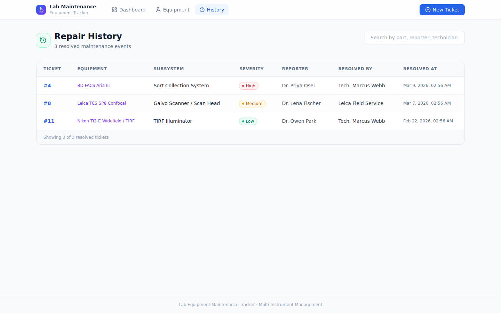

# Aria MVP — Lab Equipment Maintenance Tracker

A full-stack web application for managing maintenance tickets and repair history across multiple lab instruments. Built for flow cytometry core facilities and similar multi-instrument environments.



---

## Features

- **Kanban board** — drag-and-drop tickets across Open → In Progress → Resolved
- **Multi-equipment registry** — track any number of instruments, each with custom subsystems
- **Ticket management** — create, update, and close tickets linked to specific equipment and subsystems
- **Threaded comments** — collaborate on tickets with timestamped comment threads
- **Repair history** — filterable table of all resolved tickets across the fleet
- **Staleness indicators** — visual warnings for tickets that have been open too long
- **Global search** — find tickets by keyword across all equipment
- **QR codes** — generate per-equipment QR codes linking directly to that instrument's ticket view

---

## Screenshots

### Dashboard — Kanban View
Tickets grouped by status with equipment tags and comment counts visible on each card.


### Dashboard — List View
Sortable and filterable list view with equipment tags and inline status controls.



### Equipment Registry
Grid of all registered instruments. Click any card to view its subsystems and open tickets.



### Equipment Detail
Per-instrument view showing subsystems, open ticket count, and ticket history.



### New Ticket
Create a ticket linked to a specific piece of equipment and subsystem, with priority and description.



### Repair History
Full history of resolved tickets across all equipment, with date and resolution notes.



---

## Tech Stack

| Layer | Technology |
|---|---|
| Frontend | React 18, React Router, Lucide Icons, `@hello-pangea/dnd` |
| Backend | FastAPI, SQLAlchemy 2, Pydantic v2 |
| Database | PostgreSQL (SQLite for local dev) |
| Containerization | Docker Compose |

---

## Quick Start

### Prerequisites

- Docker and Docker Compose
- Node.js 18+ (for frontend development)
- Python 3.11+ (for backend development)

### Run with Docker Compose

```bash
docker compose up
```

The app will be available at [http://localhost:5173](http://localhost:5173). The API runs at [http://localhost:8000](http://localhost:8000).

### Seed Sample Data

```bash
docker compose exec backend python -m app.db.seed
```

This populates the registry with sample instruments (BD FACS Aria III, BD FACSMelody, Sony MA900, Beckman Coulter MoFlo) and a set of realistic maintenance tickets.

---

## Development Setup

### Backend

```bash
cd backend
python -m venv .venv
source .venv/bin/activate
pip install -r requirements.txt
uvicorn app.main:app --reload
```

### Frontend

```bash
cd frontend
npm install
npm run dev
```

### Run Tests

```bash
cd backend
pytest
```

---

## Project Structure

```
Aria_mvp/
├── backend/
│   ├── app/
│   │   ├── db/          # Database connection and seed script
│   │   ├── models/      # SQLAlchemy ORM models (Equipment, Ticket, Comment)
│   │   ├── routers/     # FastAPI route handlers
│   │   └── schemas/     # Pydantic request/response schemas
│   ├── tests/           # Pytest test suite
│   └── requirements.txt
├── frontend/
│   └── src/
│       ├── components/  # Reusable UI components
│       └── pages/       # Route-level page components
├── screenshots/         # UI screenshots
└── docker-compose.yml
```

---

## API Overview

| Method | Endpoint | Description |
|---|---|---|
| `GET` | `/api/tickets` | List all tickets (filterable by status/equipment) |
| `POST` | `/api/tickets` | Create a new ticket |
| `GET` | `/api/tickets/{id}` | Get ticket detail |
| `PATCH` | `/api/tickets/{id}` | Update ticket (status, notes, assignee) |
| `DELETE` | `/api/tickets/{id}` | Delete a ticket |
| `POST` | `/api/tickets/{id}/comments` | Add a comment |
| `GET` | `/api/tickets/history/resolved` | Repair history |
| `GET` | `/api/equipment` | List all equipment |
| `POST` | `/api/equipment` | Register new equipment |
| `GET` | `/api/equipment/{id}` | Equipment detail with subsystems |

---

## License

MIT — see [LICENSE](LICENSE).
